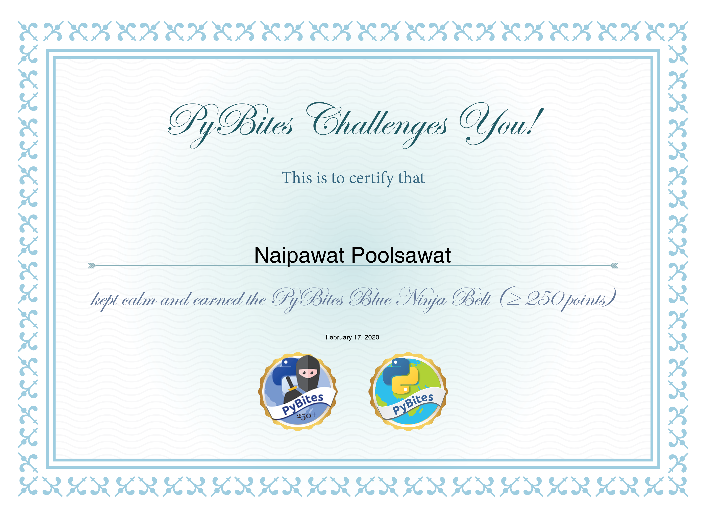
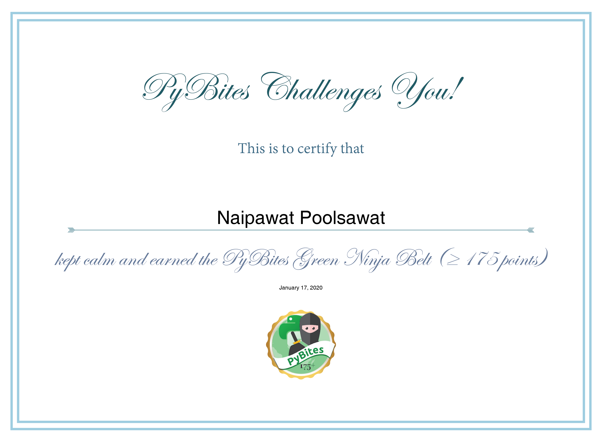
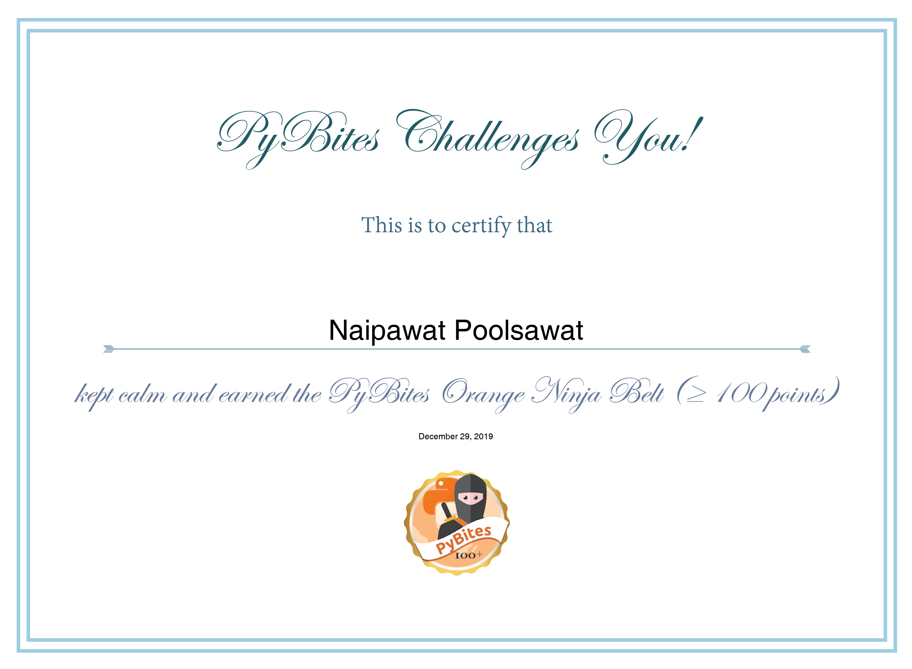
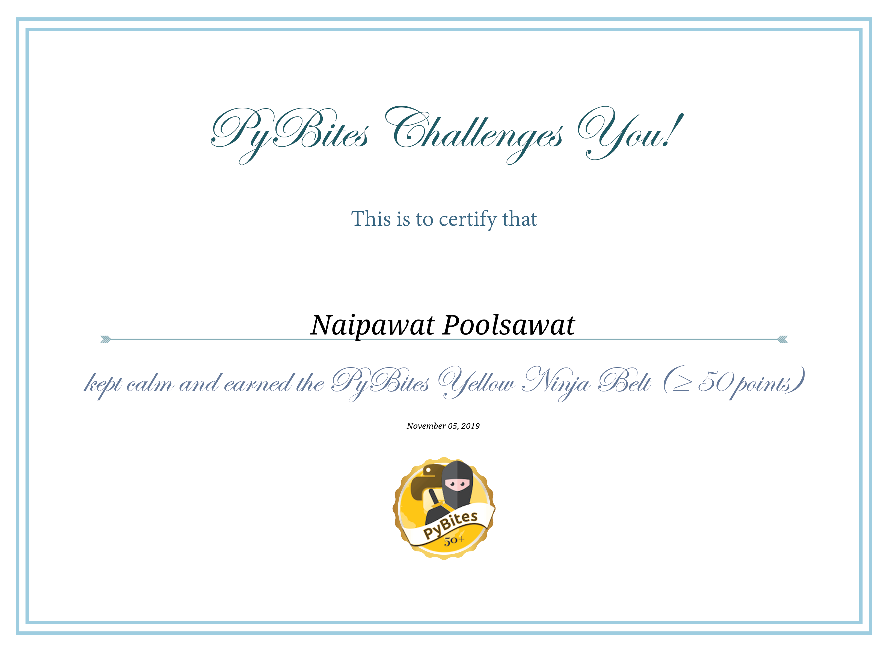
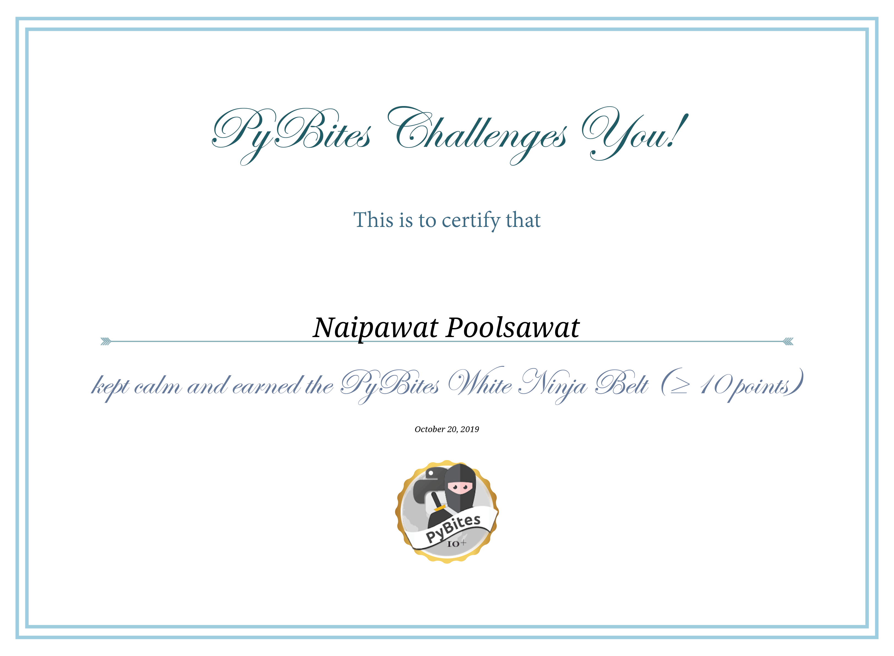
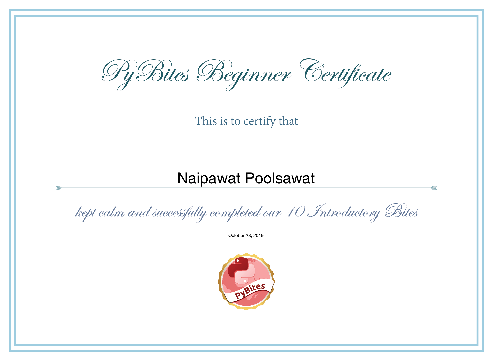

# bitesofpy
A repo for PyBites exercises.  
https://codechalleng.es/profiles/boraxpr  

| **Bite**                                                                      | **Completed**             | **Cheated** | **Score** | **Submits** |
|-------------------------------------------------------------------------------|---------------------------|-------------|-----------|-------------|
| Bite 278. Major and minor numbers                                             | Dec. 19, 2022, 6:33 a.m.  |             | 2         | 2           |
| Bite 264. Clamy Fernet                                                        | April 21, 2020, 5:34 a.m. | 🤔          | 1         | 3           |
| Bite 157. Filter out accented characters                                      | Feb. 26, 2020, 10:11 a.m. |             | 3         | 2           |
| Bite 230. Thumbs up for operator overloading                                  | Feb. 24, 2020, 2:27 p.m.  |             | 3         | 4           |
| Bite 122. Check if two words are anagrams                                     | Feb. 22, 2020, 10:44 a.m. |             | 3         | 2           |
| Bite 147. 100 WEEKDays of Code Date Range                                     | Feb. 19, 2020, 2:39 p.m.  |             | 3         | 2           |
| Bite 35. Having fun with heapq                                                | Feb. 18, 2020, 10:37 a.m. |             | 3         | 5           |
| Bite 175. Find missing dates                                                  | Feb. 18, 2020, 10:36 a.m. |             | 3         | 3           |
| Bite 47. Write a new password field validator                                 | Feb. 17, 2020, 1 p.m.     |             | 3         | 2           |
| Bite 239. Test FizzBuzz                                                       | Feb. 16, 2020, 8:46 a.m.  |             | 3         | 8           |
| Bite 219. Bite notification planner                                           | Feb. 13, 2020, 4:13 p.m.  |             | 3         | 2           |
| Bite 234. Capitalize sentences                                                | Feb. 12, 2020, 4:43 p.m.  |             | 3         | 2           |
| Bite 81. Filter and order tweets by polarity values                           | Feb. 9, 2020, 12:24 p.m.  |             | 3         | 2           |
| Bite 120. Write a numbers validation decorator                                | Feb. 7, 2020, 4:01 p.m.   |             | 3         | 2           |
| Bite 89. Playing with lists and dicts                                         | Feb. 5, 2020, 5:24 p.m.   |             | 3         | 4           |
| Bite 228. Create a Gravatar URL                                               | Feb. 2, 2020, 7:51 a.m.   |             | 3         | 2           |
| Bite 199. Multiple inheritance (__mro__)                                      | Feb. 2, 2020, 7:07 a.m.   |             | 3         | 2           |
| Bite 222. Split an iterable in groups of size n                               | Feb. 1, 2020, 8:56 a.m.   |             | 3         | 2           |
| Bite 197. What date is Mother's Day celebrated?                               | Jan. 31, 2020, 8:06 a.m.  |             | 3         | 2           |
| Bite 148. Print Car Data Grouped by Manufacturer                              | Jan. 31, 2020, 3:13 a.m.  |             | 3         | 2           |
| Bite 187. Actor/actress age at movie release                                  | Jan. 30, 2020, 6:07 a.m.  |             | 3         | 2           |
| Bite 116. List and filter files in a directory                                | Jan. 29, 2020, 9:55 a.m.  |             | 3         | 4           |
| Bite 118. List exercise: return first occurrence indices of duplicated words  | Jan. 28, 2020, 3:05 p.m.  |             | 3         | 2           |
| Bite 140. PyBites First Pandas Bite                                           | Jan. 27, 2020, 9:30 a.m.  |             | 3         | 9           |
| Bite 146. Rhombus generator                                                   | Jan. 27, 2020, 5:51 a.m.  |             | 3         | 5           |
| Bite 163. Which packages were upgraded?                                       | Jan. 26, 2020, 1:07 p.m.  |             | 3         | 3           |
| Bite 257. Extract users dict from a multiline string                          | Jan. 25, 2020, 2:26 p.m.  |             | 2         | 2           |
| Bite 132. Find the word with the most vowels                                  | Jan. 24, 2020, 5:43 a.m.  |             | 3         | 2           |
| Bite 258. What the flux?                                                      | Jan. 23, 2020, 3:36 p.m.  |             | 3         | 2           |
| Bite 30. Movie data analysis                                                  | Jan. 22, 2020, 10:22 a.m. |             | 3         | 1           |
| Bite 223. Unix file permissions                                               | Jan. 20, 2020, 2:05 p.m.  |             | 3         | 1           |
| Bite 127. Return the right ordinal suffix for a number                        | Jan. 19, 2020, 4:34 p.m.  |             | 3         | 1           |
| Bite 142. Exception Handling: Calculate the Winning Player                    | Jan. 18, 2020, 8:26 a.m.  |             | 3         | 1           |
| Bite 135. Sort a list of book objects                                         | Jan. 17, 2020, 8:43 p.m.  |             | 3         | 1           |
| Bite 159. Create a simple calculator                                          | Jan. 17, 2020, 7:51 p.m.  |             | 3         | 1           |
| Bite 111. Use the ipinfo API to lookup IP country                             | Jan. 17, 2020, 7:30 p.m.  |             | 3         | 1           |
| Bite 119. Xmas tree generator                                                 | Jan. 17, 2020, 7:02 p.m.  |             | 3         | 1           |
| Bite 113. Filter words with non-ascii characters                              | Jan. 17, 2020, 6:39 p.m.  |             | 3         | 1           |
| Bite 191. Starwars character with highest BMI                                 | Jan. 17, 2020, 6:10 p.m.  |             | 3         | 1           |
| Bite 203. Type hinting practice                                               | Jan. 17, 2020, 5:23 p.m.  |             | 3         | 12          |
| Bite 162. Vertically align output of counters                                 | Jan. 17, 2020, 4:40 p.m.  |             | 3         | 1           |
| Bite 78. Find programmers with common languages                               | Jan. 17, 2020, 3:57 p.m.  |             | 3         | 1           |
| Bite 86. Create a RGB-to-Hex converter                                        | Jan. 17, 2020, 3:16 p.m.  |             | 3         | 1           |
| Bite 62. Data structures matter - speed up your Python code                   | Jan. 17, 2020, 2:21 p.m.  |             | 3         | 1           |
| Bite 10. Practice exceptions                                                  | Jan. 17, 2020, 1:33 p.m.  |             | 3         | 1           |
| Bite 36. Having fun with *args and **kwargs                                   | Jan. 17, 2020, 1:25 p.m.  |             | 3         | 1           |
| Bite 3. Word Values                                                           | Jan. 16, 2020, 4:59 p.m.  |             | 3         | 1           |
| Bite 218. Create a sandwich decorator                                         | Jan. 16, 2020, 3:32 p.m.  |             | 2         | 1           |
| Bite 254. Global vs local variables                                           | Jan. 15, 2020, 2:29 p.m.  |             | 2         | 1           |
| Bite 225. Swap case PyBites characters                                        | Jan. 14, 2020, 5:42 a.m.  |             | 2         | 1           |
| Bite 231. Where are the emojis?                                               | Jan. 14, 2020, 4:32 a.m.  |             | 2         | 1           |
| Bite 252. Let's play with Pandas Series                                       | Jan. 13, 2020, 11:04 a.m. |             | 2         | 1           |
| Bite 251. Introducing Pandas Series                                           | Jan. 13, 2020, 3:45 a.m.  |             | 2         | 1           |
| Bite 246. Test print / standard output                                        | Jan. 13, 2020, 3:02 a.m.  |             | 2         | 3           |
| Bite 16. PyBites date generator                                               | Jan. 12, 2020, 1:52 p.m.  |             | 2         | 2           |
| Bite 210. Add Type Annotations                                                | Jan. 11, 2020, 2:49 p.m.  |             | 2         | 8           |
| Bite 209. Write a Sphinx docstring                                            | Jan. 11, 2020, 2:30 p.m.  |             | 2         | 6           |
| Bite 192. Some logging practice                                               | Jan. 11, 2020, 1:53 p.m.  |             | 2         | 3           |
| Bite 54. Nicer formatting of a poem or text                                   | Jan. 9, 2020, 6:23 a.m.   |             | 2         | 1           |
| Bite 15. Enumerate 2 sequences                                                | Jan. 7, 2020, 7:19 a.m.   |             | 2         | 1           |
| Bite 136. Bloodtypes                                                          | Jan. 5, 2020, 3:40 p.m.   |             | 2         | 1           |
| Bite 149. Sorting words with constraint                                       | Jan. 5, 2020, 5:31 a.m.   |             | 2         | 1           |
| Bite 238. Write tests for Fibonacci                                           | Dec. 31, 2019, 5:41 p.m.  |             | 2         | 1           |
| Bite 21. Query a nested data structure                                        | Dec. 31, 2019, 6:52 a.m.  |             | 2         | 1           |
| Bite 172. Having fun with Python Partials                                     | Dec. 29, 2019, 3:19 p.m.  |             | 2         | 1           |
| Bite 169. Simple length converter                                             | Dec. 29, 2019, 3:02 p.m.  |             | 2         | 1           |
| Bite 167. Complete a User class: properties and representation dunder methods | Dec. 29, 2019, 2:40 p.m.  |             | 2         | 1           |
| Bite 165. Parse an /etc/passwd file output                                    | Dec. 29, 2019, 2:15 p.m.  |             | 2         | 2           |
| Bite 161. Count the number of files and directories                           | Dec. 29, 2019, 1:28 p.m.  |             | 2         | 3           |
| Bite 19. Write a property                                                     | Dec. 25, 2019, 5:24 p.m.  |             | 2         | 1           |
| Bite 128. Work with datetime's strptime and strftime                          | Dec. 24, 2019, 11:58 a.m. |             | 2         | 1           |
| Bite 64. Fix a truncating zip function                                        | Dec. 24, 2019, 11:25 a.m. |             | 2         | 2           |
| Bite 117. Round a number even (a.k.a. banker's rounding)                      | Dec. 23, 2019, 2:07 p.m.  |             | 2         | 1           |
| Bite 66. Calculate the running average of a sequence                          | Dec. 23, 2019, 9:52 a.m.  |             | 2         | 1           |
| Bite 56. Add a command line interface to our BMI calculator                   | Dec. 23, 2019, 8:56 a.m.  |             | 2         | 1           |
| Bite 91. Matching multiple strings                                            | Dec. 22, 2019, 4:22 p.m.  |             | 2         | 1           |
| Bite 43. Force keyword arguments                                              | Dec. 22, 2019, 3:50 p.m.  |             | 2         | 1           |
| Bite 44. License key generator                                                | Dec. 22, 2019, 10:29 a.m. |             | 2         | 3           |
| Bite 100. Display the last part of a file (Unix tail)                         | Dec. 21, 2019, 9:36 a.m.  |             | 2         | 2           |
| Bite 96. Build Unix' wc program in Python                                     | Dec. 21, 2019, 9:10 a.m.  |             | 2         | 2           |
| Bite 214. A countdown generator                                               | Nov. 14, 2019, 4:41 a.m.  |             | 2         | 2           |
| Bite 176. Create a variable length chessboard                                 | Nov. 14, 2019, 3:41 a.m.  |             | 2         | 1           |
| Bite 208. Find the number pairs summing up N                                  | Nov. 12, 2019, 5:55 a.m.  |             | 2         | 1           |
| Bite 153. Round a sequence of numbers                                         | Nov. 11, 2019, 3:56 a.m.  |             | 2         | 1           |
| Bite 143. Look up a value in 3 dictionaries                                   | Nov. 10, 2019, 10:53 a.m. |             | 2         | 3           |
| Bite 83. At what time does PyBites live?                                      | Nov. 6, 2019, 9:45 a.m.   |             | 2         | 1           |
| Bite 115. Count leading spaces                                                | Nov. 5, 2019, 8:10 a.m.   |             | 2         | 1           |
| Bite 29. Martin's IQ test                                                     | Nov. 5, 2019, 7:49 a.m.   |             | 2         | 2           |
| Bite 80. Check equality of two lists                                          | Nov. 5, 2019, 5:28 a.m.   |             | 2         | 1           |
| Bite 77. New places to travel to                                              | Nov. 5, 2019, 4:40 a.m.   |             | 2         | 1           |
| Bite 189. Filter a list of names                                              | Nov. 4, 2019, 6:43 a.m.   |             | 2         | 3           |
| Bite 74. What day of the week were you born on?                               | Nov. 3, 2019, 10:49 a.m.  |             | 2         | 1           |
| Bite 67. Working with datetimes                                               | Nov. 3, 2019, 10:11 a.m.  |             | 2         | 1           |
| Bite 133. Convert an Amazon URL into an affiliation link                      | Nov. 3, 2019, 8:42 a.m.   |             | 2         | 5           |
| Bite 68. Remove punctuation characters from a string                          | Nov. 2, 2019, 8:16 a.m.   |             | 2         | 1           |
| Bite 55. Get the latest game releases from Steam's RSS feed                   | Nov. 1, 2019, 12:25 p.m.  |             | 2         | 1           |
| Bite 46. You are a programmer! Code Fizz Buzz                                 | Oct. 31, 2019, 5:53 p.m.  |             | 2         | 5           |
| Bite 37. Rewrite a for loop using recursion                                   | Oct. 31, 2019, 5:21 p.m.  |             | 2         | 5           |
| Bite 32. Don't let mutability fool you                                        | Oct. 29, 2019, 8:06 a.m.  |             | 2         | 1           |
| Bite 26. Dictionary comprehensions are awesome                                | Oct. 29, 2019, 3:07 a.m.  |             | 2         | 1           |
| Intro Bite 06. Strip out vowels and count the number of replacements          | Oct. 28, 2019, 4:28 p.m.  |             | 1         | 1           |
| Intro Bite 09. Workout dictionary lookups                                     | Oct. 28, 2019, 5:58 a.m.  |             | 1         | 3           |
| Intro Bite 07. Filter numbers with a list comprehension                       | Oct. 27, 2019, 8:54 a.m.  |             | 1         | 2           |
| Intro Bite 10. Type conversion and exception handling                         | Oct. 27, 2019, 8:22 a.m.  |             | 1         | 1           |
| Bite 8. Rotate string characters                                              | Oct. 27, 2019, 8:12 a.m.  |             | 2         | 2           |
| Intro Bite 05. Slice and dice                                                 | Oct. 26, 2019, 9:45 a.m.  |             | 1         | 5           |
| Intro Bite 04. Split and join                                                 | Oct. 25, 2019, 2:32 a.m.  |             | 1         | 1           |
| Intro Bite 03. Loop through a dictionary and pluralise a word                 | Oct. 23, 2019, 4:34 p.m.  |             | 1         | 2           |
| Bite 5. Parse a list of names                                                 | Oct. 23, 2019, 4:31 p.m.  |             | 2         | 1           |
| Intro Bite 02. Infinite loop, input, continue and break                       | Oct. 22, 2019, 6:42 p.m.  |             | 1         | 4           |
| Intro Bite 01. F-strings and a simple if/else                                 | Oct. 22, 2019, 6:20 p.m.  |             | 1         | 3           |
| Bite 38. Using ElementTree to parse XML                                       | Oct. 22, 2019, 6:11 p.m.  |             | 2         | 1           |
| Bite 130. Analyze some basic Car Data                                         | Oct. 21, 2019, 5:09 p.m.  |             | 2         | 1           |
| Bite 188. Get statistics from PyBites test code                               | Oct. 20, 2019, 8:11 p.m.  |             | 2         | 1           |
| Bite 181. Keep a list sorted upon insert                                      | Oct. 20, 2019, 6:31 p.m.  |             | 2         | 2           |
| Bite 180. Group names by country                                              | Oct. 20, 2019, 5:57 p.m.  |             | 2         | 6           |
| Bite 45. Keep a queue of last n items                                         | Oct. 20, 2019, 3:18 p.m.  |             | 2         | 2           |
| Intro Bite 08. Loop over a dict of namedtuples calculating a total score      | Oct. 19, 2019, 7:07 p.m.  |             | 1         | 1           |
| Bite 1. Sum n numbers                                                         | Oct. 16, 2019, 5:01 a.m.  |             | 2         | 1           |

